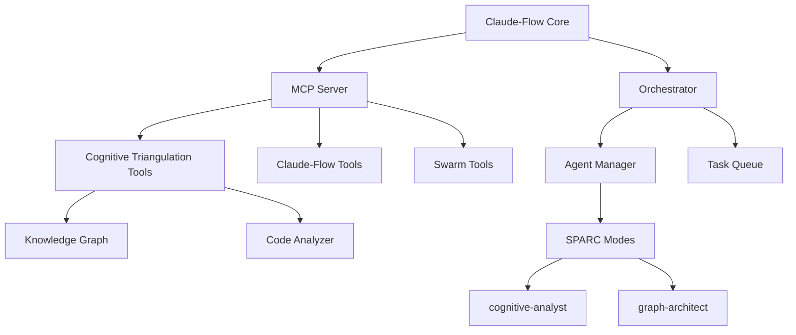

# 🧠 Claude-Flow Enhanced: AI Agent Orchestration with Cognitive Triangulation

<div align="center">

[](https://github.com/groeimetai/claude-code-flow)
[](https://github.com/groeimetai/claude-code-flow)
[](https://github.com/groeimetai/claude-code-flow)
[](https://github.com/groeimetai/claude-code-flow)
[](https://opensource.org/licenses/MIT)

</div>

## 🚀 **Enhanced Fork with Cognitive Triangulation**

This is an enhanced fork of [Claude-Flow](https://github.com/ruvnet/claude-code-flow) by [@ruvnet](https://github.com/ruvnet), extending it with powerful **Cognitive Triangulation** capabilities for deep code analysis and knowledge graph generation.

> 🎯 **Version 2.0.0**: Adds advanced code analysis, knowledge graphs, and intelligent swarm coordination

## 🏃 **Test Drive - Quick Start!**

### 🚀 **Try Without Installation (NPX)**
```bash
# Initialize project with SPARC modes
npx github:groeimetai/claude-code-flow init --sparc

# Test the achieve command (launches Claude Code)
npx github:groeimetai/claude-code-flow achieve "Create a calculator" --dry-run

# Full autonomous development (requires Claude Code installed)
npx github:groeimetai/claude-code-flow achieve "Build trading system"
```

### 📦 **Full Installation (Recommended)**
```bash
# Clone and install
git clone https://github.com/groeimetai/claude-code-flow.git
cd claude-code-flow
npm install
npm link  # Makes 'claude-flow' available globally

# Now use anywhere:
claude-flow init --sparc
claude-flow achieve "Create a URL shortener service with analytics"
```

### 🤖 **What happens with `achieve` command:**
1. Launches Claude Code with meta-orchestrator prompt
2. Claude analyzes your goal and creates a plan
3. Spawns specialized swarms iteratively
4. Uses cognitive triangulation for code understanding
5. Self-corrects and improves with each iteration
6. Continues until goal is achieved (95% threshold)

⚠️ **Note**: The `achieve` command launches Claude Code. Make sure you have Claude Code installed and configured with your API key.

## 🆕 **What's New in v2.0.0**

### 🧠 **Cognitive Triangulation Integration**
- **5 New MCP Tools** for deep code analysis
- **2 New SPARC Modes**: `cognitive-analyst` and `graph-architect`
- **Knowledge Graph Generation** with Neo4j, JSON, and GraphML support
- **Semantic Code Analysis** with relationship mapping
- **POI Extraction** for functions, classes, methods, and more
- **Automatic Analysis** during iterations for better understanding

### 🐝 **Enhanced Swarm Capabilities**
- **Self-Aware Swarms** that can improve themselves autonomously
- **Tool Discovery** - Swarms find and use capabilities independently
- **Meta-Learning** - Learn from experience and share knowledge
- **Autonomous Evolution** - Swarms create improved versions of themselves
- **Collective Intelligence** - Share learnings across swarm instances

### 🎯 **Autonomous Goal Achievement** (NEW!)
```bash
# Clone and run locally (required for achieve command)
git clone https://github.com/groeimetai/claude-code-flow.git
cd claude-code-flow
npm install

# Launch autonomous goal achievement
./claude-flow achieve "Create a profitable trading system"

# The system launches Claude Code with a meta-orchestrator that:
# 1. Analyzes your goal and extracts success criteria
# 2. Creates an iterative loop of swarm orchestration
# 3. Each iteration builds on previous progress
# 4. Uses ALL available tools (cognitive triangulation, neural swarms, etc.)
# 5. Continues until 95% success threshold is reached
# 6. No manual intervention - fully autonomous!

# Requires Claude Code to be installed: https://claude.ai/code
```

#### 🎮 **Achieve Command Options**
```bash
claude-flow achieve <goal> [options]

Options:
  --max-iterations <n>  Maximum iterations to attempt (default: 10)
  --convergence <n>     Success threshold 0-1 (default: 0.95)
  --parallel           Enable parallel swarm execution
  --no-evolve          Disable autonomous evolution
  --budget <n>         Maximum resource budget
  --deadline <date>    Deadline for goal achievement
  --verbose            Show detailed progress
  --dry-run            Show configuration without executing

Examples:
  # Simple goal
  claude-flow achieve "Create a todo app" --dry-run
  
  # Complex with options
  claude-flow achieve "Build ML trading bot" --max-iterations 20 --parallel
  
  # With constraints
  claude-flow achieve "Create SaaS platform" --budget 1000 --deadline 2024-02-01
```

### 🧠 **Cognitive Triangulation Usage**
```bash
# Analyze entire codebase
./claude-flow sparc run cognitive-analyst "Analyze this project's architecture"

# Build knowledge graph
./claude-flow sparc run graph-architect "Create a knowledge graph of all dependencies"

# Query relationships
./claude-flow sparc run cognitive-analyst "What components depend on the auth module?"

# Extract POIs
./claude-flow sparc run cognitive-analyst "Extract all API endpoints and their handlers"
```

## 🎯 **New Cognitive Triangulation Tools**

### 1. **`cognitive_triangulation/analyze_codebase`**
Comprehensive codebase analysis with pattern recognition
```javascript
{
  "projectPath": "/path/to/project",
  "includePatterns": ["*.js", "*.ts"],
  "excludePatterns": ["node_modules/**"]
}
```

### 2. **`cognitive_triangulation/extract_pois`**
Extract Points of Interest from code
```javascript
{
  "filePaths": ["src/index.js"],
  "poiTypes": ["function", "class", "method"],
  "includeContext": true
}
```

### 3. **`cognitive_triangulation/query_relationships`**
Natural language queries about code structure
```javascript
{
  "query": "Show all functions that call the database",
  "depth": 3
}
```

### 4. **`cognitive_triangulation/build_graph`**
Build persistent knowledge graphs
```javascript
{
  "projectPath": "/path/to/project",
  "format": "neo4j",
  "incremental": true
}
```

### 5. **`cognitive_triangulation/cleanup_graph`**
Maintain graph integrity
```javascript
{
  "graphPath": "/path/to/graph",
  "dryRun": false
}
```

## 🚀 **Quick NPX Examples**

### 🎯 **Autonomous Goal Achievement**
```bash
# Create any system autonomously
npx github:groeimetai/claude-code-flow achieve "Build a SaaS billing system with Stripe"
npx github:groeimetai/claude-code-flow achieve "Create a real-time chat application"
npx github:groeimetai/claude-code-flow achieve "Develop a machine learning pipeline"
```

### 🐝 **Self-Aware Swarms**
```bash
# Run self-improving swarms without installation
npx github:groeimetai/claude-code-flow swarm "Optimize this codebase" --self-aware advanced
npx github:groeimetai/claude-code-flow swarm "Build REST API" --evolution --collective
```

### 🧠 **SPARC Modes**
```bash
# Use any SPARC mode directly
npx github:groeimetai/claude-code-flow sparc run neural-orchestrator "Analyze system architecture"
npx github:groeimetai/claude-code-flow sparc run cognitive-analyst "Find code smells"
npx github:groeimetai/claude-code-flow sparc run autonomous-architect "Design microservices"
```

## 📊 **Progress Monitoring**

### Real-time Progress Visibility

The system provides detailed progress monitoring:

```bash
# Enable verbose progress monitoring
npx github:groeimetai/claude-code-flow achieve "Build API" --verbose --monitor

# You'll see:
════════════════════════════════════════════════════════════
🎯 Iteration 1 - Exploration & Foundation
════════════════════════════════════════════════════════════

🧠 Running automatic cognitive triangulation...
Progress: ████████░░░░░░░░░░░░ 40%
Phase: Architecture Design
Active tasks: 3

💡 Learning: Database should use PostgreSQL for scalability
✨ Spawned neural-orchestrator swarm: Design optimal schema

🧠 Cognitive Analysis Complete:
  - Components: 42
  - Relationships: 127
  - Complexity: medium
```

### Progress Phases

Each iteration goes through clear phases:
- **0-30%**: Research & Architecture
- **30-60%**: Core Implementation
- **60-80%**: Testing & Optimization
- **80-100%**: Polish & Validation

### Automatic Cognitive Triangulation

The system automatically analyzes the project:
- **Every iteration start**: Full architecture analysis
- **After major changes**: Impact assessment
- **When stuck**: Deep root cause analysis
- **Before optimization**: Performance bottleneck identification

## 🤖 **Enhanced Swarm Automation Examples**

### 🎯 **Auto-Refactoring Swarm**
```bash
# Automatically refactor code based on analysis
npx github:groeimetai/claude-code-flow swarm "Refactor codebase using cognitive analysis" \
  --strategy optimization \
  --mode hierarchical \
  --agents cognitive-analyst,graph-architect,coder,tester \
  --auto-commit
```

### 🔍 **Dependency Migration Swarm**
```bash
# Migrate dependencies intelligently
npx github:groeimetai/claude-code-flow swarm "Migrate from Express to Fastify" \
  --analyze-first \
  --preserve-functionality \
  --test-coverage 90
```

### 🛡️ **Security Audit Swarm**
```bash
# Deep security analysis with fixes
npx github:groeimetai/claude-code-flow swarm "Security audit with automatic fixes" \
  --cognitive-scan \
  --fix-vulnerabilities \
  --generate-report
```

### 🧠 **Self-Aware Swarm**
```bash
# Create a self-improving swarm
npx github:groeimetai/claude-code-flow swarm "Build self-optimizing API server" \
  --self-aware advanced \
  --evolution \
  --collective \
  --meta-learning

# The swarm will:
# 1. Build the API server
# 2. Analyze its own performance
# 3. Identify optimization opportunities
# 4. Spawn specialized agents for improvements
# 5. Learn and share insights with other swarms
```

## 🏗️ **Architecture**



## 📊 **Comparison with Original**

| Feature | Original Claude-Flow | Enhanced Version |
|---------|---------------------|------------------|
| SPARC Modes | 17 | 24 (+7 enhanced) |
| MCP Tools | Standard | +21 Unified Tools |
| Code Analysis | Basic | Deep Semantic Analysis |
| Knowledge Graphs | ❌ | ✅ Neo4j, JSON, GraphML |
| Swarm Intelligence | Rule-based | Self-Aware & Learning |
| Architecture Discovery | Manual | Automatic |
| Goal Achievement | Manual Steps | ✅ Fully Autonomous |
| Self-Improvement | ❌ | ✅ Continuous Evolution |
| Neural Capabilities | ❌ | ✅ 84.8% SWE-Bench |
| Distributed ML | ❌ | ✅ Prime Framework |
| Progress Monitoring | Basic | ✅ Visual Progress Bars |
| Automatic CT Analysis | ❌ | ✅ Every Iteration |

## 🔧 **Configuration**

### API Key Management

The system works with or without external services:

#### Option 1: Full Features (with Neo4j & Redis)
```bash
# Set these for full cognitive triangulation features
export NEO4J_URI=bolt://localhost:7687
export NEO4J_USER=neo4j
export NEO4J_PASSWORD=your-password
export REDIS_URL=redis://localhost:6379
```

#### Option 2: Local-Only Mode (No External Services)
```bash
# Use local file storage - no API keys needed!
export COGNITIVE_GRAPH_FORMAT=json
export COGNITIVE_CACHE_TYPE=file
```

The system automatically detects available services and adapts:
- ✅ No Neo4j? Uses JSON-based graphs locally
- ✅ No Redis? Uses file-based caching
- ✅ Missing API keys? Falls back gracefully

### Environment Variables
```bash
# Cognitive Triangulation Path
export COGNITIVE_TRIANGULATION_PATH=/usr/local/bin/cognitive-triangulation-mcp

# Neo4j Connection (for knowledge graphs) - OPTIONAL
export NEO4J_URI=bolt://localhost:7687
export NEO4J_USER=neo4j
export NEO4J_PASSWORD=password

# Redis Connection (for caching) - OPTIONAL
export REDIS_URL=redis://localhost:6379

# If not set, system uses local JSON graphs and file caching
export COGNITIVE_GRAPH_FORMAT=json  # Use when Neo4j not available
export COGNITIVE_CACHE_TYPE=file    # Use when Redis not available
```

### Enhanced `.claude/settings.json`
```json
{
  "cognitiveTriangulation": {
    "enabled": true,
    "autoAnalyze": true,
    "graphFormat": "neo4j",  // or "json" if no Neo4j
    "incrementalUpdates": true,
    "analysisInterval": 300000,  // 5 minutes between auto-analysis
    "fallbackToLocal": true  // Use local storage if external services unavailable
  },
  "progressMonitoring": {
    "visual": true,
    "updateFrequency": 5000,  // Update every 5 seconds
    "showPhases": true,
    "showActiveTasks": true
  }
}
```

## 🚀 **Roadmap**

### v2.1.0 (Planned)
- [ ] Visual Knowledge Graph Explorer
- [ ] Auto-generated Architecture Diagrams
- [ ] Real-time Code Impact Analysis
- [ ] Intelligent Merge Conflict Resolution
- [ ] Cross-repository Analysis

### v2.2.0 (Future)
- [ ] AI-powered Code Reviews
- [ ] Automatic Technical Debt Detection
- [ ] Smart Refactoring Suggestions
- [ ] Performance Bottleneck Prediction
- [ ] Security Vulnerability Prediction

## 🤝 **Credits**

This project is an enhanced fork of [Claude-Flow](https://github.com/ruvnet/claude-code-flow) originally created by [@ruvnet](https://github.com/ruvnet). 

### Original Features by @ruvnet:
- Core orchestration system
- SPARC development framework
- MCP server implementation
- Swarm coordination
- Terminal management
- Original 17 SPARC modes

### Enhancements in this Fork:
- Cognitive Triangulation integration (5 tools)
- ruv-FANN Neural Swarm integration (84.8% SWE-Bench)
- DAA Autonomous Agents integration (7 tools)
- Knowledge graph capabilities
- Enhanced swarm intelligence with cognitive diversity
- Distributed ML with Prime framework
- Quantum-resistant security
- 7 new SPARC modes
- 21+ new MCP tools

## 📝 **License**

MIT License - See [LICENSE](LICENSE) file for details.

## 🌟 **Contributing**

Contributions are welcome! Please feel free to submit a Pull Request.

## 📧 **Contact**

- Enhanced Fork: [@groeimetai](https://github.com/groeimetai)
- Original Project: [@ruvnet](https://github.com/ruvnet)

---

<div align="center">
<strong>⚡ Powered by Claude-Flow + Cognitive Triangulation ⚡</strong>
</div>