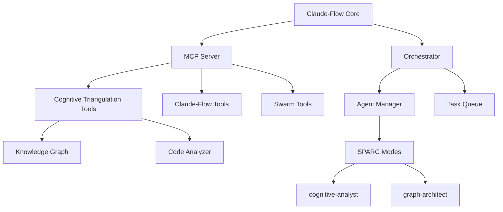

# 🧠 Claude-Flow Enhanced: AI Agent Orchestration with Cognitive Triangulation

<div align="center">

[](https://github.com/groeimetai/claude-code-flow)
[](https://github.com/groeimetai/claude-code-flow)
[](https://github.com/groeimetai/claude-code-flow)
[](https://github.com/groeimetai/claude-code-flow)
[](https://opensource.org/licenses/MIT)

</div>

## 🚀 **Enhanced Fork with Cognitive Triangulation**

This is an enhanced fork of [Claude-Flow](https://github.com/ruvnet/claude-code-flow) by [@ruvnet](https://github.com/ruvnet), extending it with powerful **Cognitive Triangulation** capabilities for deep code analysis and knowledge graph generation.

> 🎯 **Version 2.0.0**: Adds advanced code analysis, knowledge graphs, and intelligent swarm coordination

## 🆕 **What's New in v2.0.0**

### 🧠 **Cognitive Triangulation Integration**
- **5 New MCP Tools** for deep code analysis
- **2 New SPARC Modes**: `cognitive-analyst` and `graph-architect`
- **Knowledge Graph Generation** with Neo4j, JSON, and GraphML support
- **Semantic Code Analysis** with relationship mapping
- **POI Extraction** for functions, classes, methods, and more

### 🐝 **Enhanced Swarm Capabilities**
- **Intelligent Task Distribution** based on code analysis
- **Dependency-Aware Coordination** using knowledge graphs
- **Auto-Discovery** of code patterns and architectures
- **Parallel Analysis** with cognitive triangulation

## ⚡ **Quick Start**

### 🚀 **Installation**
```bash
# Clone this enhanced version
git clone https://github.com/groeimetai/claude-code-flow.git
cd claude-code-flow

# Install dependencies
npm install

# Initialize with SPARC and Cognitive Triangulation
./claude-flow init --sparc --cognitive

# Start with UI
./claude-flow start --ui --port 3000
```

### 🧠 **Cognitive Triangulation Usage**
```bash
# Analyze entire codebase
./claude-flow sparc run cognitive-analyst "Analyze this project's architecture"

# Build knowledge graph
./claude-flow sparc run graph-architect "Create a knowledge graph of all dependencies"

# Query relationships
./claude-flow sparc run cognitive-analyst "What components depend on the auth module?"

# Extract POIs
./claude-flow sparc run cognitive-analyst "Extract all API endpoints and their handlers"
```

## 🎯 **New Cognitive Triangulation Tools**

### 1. **`cognitive_triangulation/analyze_codebase`**
Comprehensive codebase analysis with pattern recognition
```javascript
{
  "projectPath": "/path/to/project",
  "includePatterns": ["*.js", "*.ts"],
  "excludePatterns": ["node_modules/**"]
}
```

### 2. **`cognitive_triangulation/extract_pois`**
Extract Points of Interest from code
```javascript
{
  "filePaths": ["src/index.js"],
  "poiTypes": ["function", "class", "method"],
  "includeContext": true
}
```

### 3. **`cognitive_triangulation/query_relationships`**
Natural language queries about code structure
```javascript
{
  "query": "Show all functions that call the database",
  "depth": 3
}
```

### 4. **`cognitive_triangulation/build_graph`**
Build persistent knowledge graphs
```javascript
{
  "projectPath": "/path/to/project",
  "format": "neo4j",
  "incremental": true
}
```

### 5. **`cognitive_triangulation/cleanup_graph`**
Maintain graph integrity
```javascript
{
  "graphPath": "/path/to/graph",
  "dryRun": false
}
```

## 🤖 **Enhanced Swarm Automation Ideas**

### 🎯 **Auto-Refactoring Swarm**
```bash
# Automatically refactor code based on analysis
./claude-flow swarm "Refactor codebase using cognitive analysis" \
  --strategy optimization \
  --mode hierarchical \
  --agents cognitive-analyst,graph-architect,coder,tester \
  --auto-commit
```

### 🔍 **Dependency Migration Swarm**
```bash
# Migrate dependencies intelligently
./claude-flow swarm "Migrate from Express to Fastify" \
  --analyze-first \
  --preserve-functionality \
  --test-coverage 90
```

### 🛡️ **Security Audit Swarm**
```bash
# Deep security analysis with fixes
./claude-flow swarm "Security audit with automatic fixes" \
  --cognitive-scan \
  --fix-vulnerabilities \
  --generate-report
```

## 🏗️ **Architecture**



## 📊 **Comparison with Original**

| Feature | Original Claude-Flow | Enhanced Version |
|---------|---------------------|------------------|
| SPARC Modes | 17 | 19 (+2 cognitive) |
| MCP Tools | Standard | +5 Cognitive Tools |
| Code Analysis | Basic | Deep Semantic Analysis |
| Knowledge Graphs | ❌ | ✅ Neo4j, JSON, GraphML |
| Swarm Intelligence | Rule-based | Analysis-driven |
| Architecture Discovery | Manual | Automatic |

## 🔧 **Configuration**

### Environment Variables
```bash
# Cognitive Triangulation Path
export COGNITIVE_TRIANGULATION_PATH=/usr/local/bin/cognitive-triangulation-mcp

# Neo4j Connection (for knowledge graphs)
export NEO4J_URI=bolt://localhost:7687
export NEO4J_USER=neo4j
export NEO4J_PASSWORD=password
```

### Enhanced `.claude/settings.json`
```json
{
  "cognitiveTriangulation": {
    "enabled": true,
    "autoAnalyze": true,
    "graphFormat": "neo4j",
    "incrementalUpdates": true
  }
}
```

## 🚀 **Roadmap**

### v2.1.0 (Planned)
- [ ] Visual Knowledge Graph Explorer
- [ ] Auto-generated Architecture Diagrams
- [ ] Real-time Code Impact Analysis
- [ ] Intelligent Merge Conflict Resolution
- [ ] Cross-repository Analysis

### v2.2.0 (Future)
- [ ] AI-powered Code Reviews
- [ ] Automatic Technical Debt Detection
- [ ] Smart Refactoring Suggestions
- [ ] Performance Bottleneck Prediction
- [ ] Security Vulnerability Prediction

## 🤝 **Credits**

This project is an enhanced fork of [Claude-Flow](https://github.com/ruvnet/claude-code-flow) originally created by [@ruvnet](https://github.com/ruvnet). 

### Original Features by @ruvnet:
- Core orchestration system
- SPARC development framework
- MCP server implementation
- Swarm coordination
- Terminal management
- Original 17 SPARC modes

### Enhancements in this Fork:
- Cognitive Triangulation integration (5 tools)
- ruv-FANN Neural Swarm integration (84.8% SWE-Bench)
- DAA Autonomous Agents integration (7 tools)
- Knowledge graph capabilities
- Enhanced swarm intelligence with cognitive diversity
- Distributed ML with Prime framework
- Quantum-resistant security
- 7 new SPARC modes
- 21+ new MCP tools

## 📝 **License**

MIT License - See [LICENSE](LICENSE) file for details.

## 🌟 **Contributing**

Contributions are welcome! Please feel free to submit a Pull Request.

## 📧 **Contact**

- Enhanced Fork: [@groeimetai](https://github.com/groeimetai)
- Original Project: [@ruvnet](https://github.com/ruvnet)

---

<div align="center">
<strong>⚡ Powered by Claude-Flow + Cognitive Triangulation ⚡</strong>
</div>